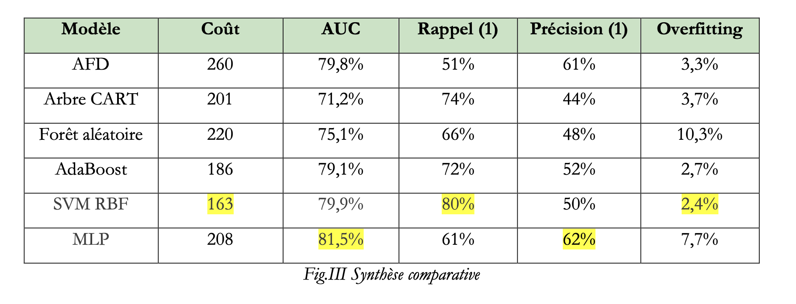
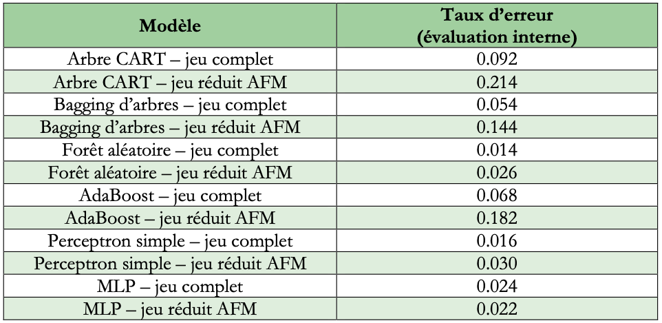
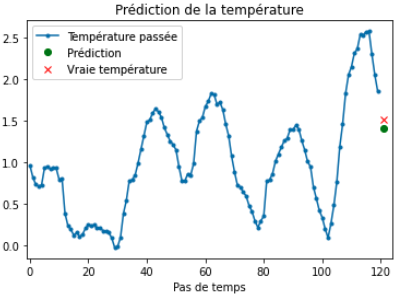
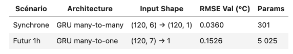
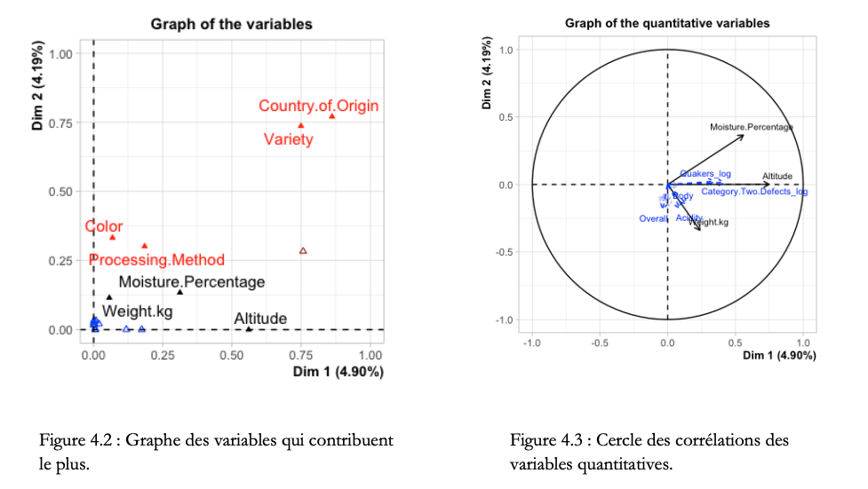
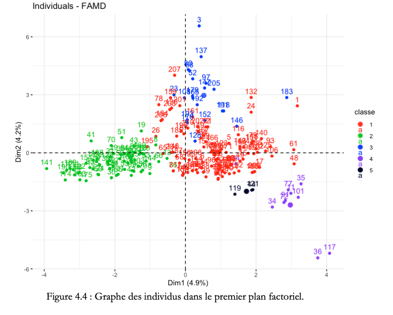
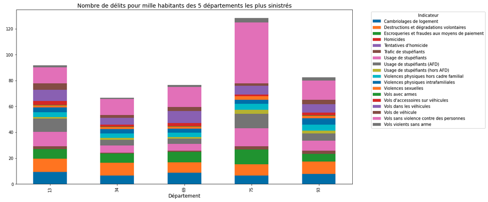
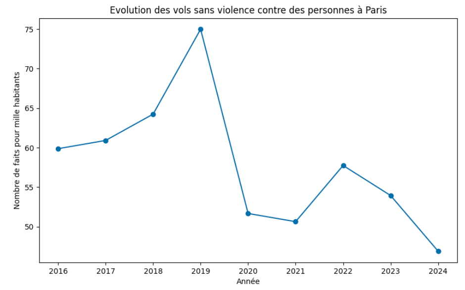
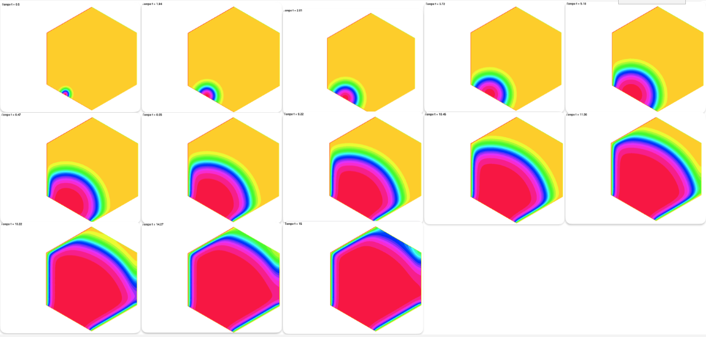

# Valérie Plusquellec – Data analyst - Data Scientist

Étudiante en 2e année de Master TRIED à Paris, je suis aussi spécialisée en mathématiques fondamentales et appliquées. 

Je possède des compétences solides en modélisation et analyse de problèmes complexes, et j’ai à cœur de vulgariser et de synthétiser mes travaux pour les rendre compréhensibles par tous. 

Je souhaite apporter ma rigueur, ma créativité et mon dynamisme dans les missions qui me seront confiées.      

***

## DERNIERS PROJETS DATA

#### 1. Décision d'accorder ou non un crédit bancaire (Python) [lien](https://github.com/valplus6/valerie.plusquellec/blob/6284faab3de8cf0aa3d2856b58f92262285bc122/projets/RCP209_Projet_Plusquellec.pdf)  
Construction d'un modèle prédictif pour mesurer si un crédit est risqué : EDA + Analyse et comparaison de modèles décisionnels (AFD, CART, ADABOOST, SVM RBF, MLP) 

*Outils : Python (pandas, matplotlib, seaborn, scikitLearn)*

#### 2. Classification multi-classe sur données complexes à haute dimension (R) [lien](https://github.com/valplus6/valerie.plusquellec/blob/main/projets/STA211_Projet_rapport.pdf)
Projet de machine learning supervisé et non supervisé sur un jeu de données composé de 649 variables structurées en plusieurs blocs d’indicateurs. Réalisation d’une analyse exploratoire globale et par blocs, réduction de dimension par ACP, classification des individus et des variables, puis comparaison de modèles supervisés pour prédire les classes. Analyse des variables discriminantes, des confusions entre classes et des performances des modèles afin de produire des résultats interprétables et reproductibles. 

*Outils : R, FactoMineR, ggplot2, dplyr, randomForest, caret*

#### 3. Prédiction de température (Python) [lien](https://github.com/valplus6/valerie.plusquellec/blob/d3a95c0747ae30e1b503b200a9ff97f665cbbf56/projets/Projet_serie_temp.ipynb)
Construction d'un réseau récurrent LSTM pour imputer des températures manquantes ou pour prédire une température future. 

*Outils : Python (pandas, matplotlib, TensorFlow, Keras)*

#### 4. Etude la qualité du café (R) [Lien](https://github.com/valplus6/valerie.plusquellec/blob/main/projets/qualite_cafe.pdf)
Approche statistique sous R pour caractériser la qualité du café à partir d’un jeu de données complexe : analyse factorielle de données mixtes, classifications et recommandations qualitatives. 

*Outils : R (ggplot2, dplyr)*

#### 5. Criminalité en France (Python) [Lien](https://github.com/valplus6/valerie.plusquellec/blob/main/projets/criminalite.ipynb)
Exploration des tendances de la criminalité sur les départements français : extraction, nettoyage, visualisation des données ouvertes, création de graphiques circulaires/barres empilées, analyse des variations selon le type de délit. 

*Outils : Python (pandas, matplotlib, numpy)*

#### 5. Propagation des frelons pattes jaunes (Python, FreeFEM++) [Lien](https://github.com/valplus6/valerie.plusquellec/blob/main/projets/propagation_frelons.ipynb)  
Modélisation et prédiction de la propagation et de la croissance des populations de frelons à pattes jaunes à l’aide d’équations aux dérivées partielles (Fisher-KPP), éléments finis et schémas d’Euler implicite. Génération de maillages hexagonaux et analyse d’impact des conditions aux bords. 

*Outils : Python(numpy, matplotlib), FreeFem++*

***

## COMPETENCES TECHNIQUES

Langages & Frameworks : Python (NumPy, Pandas, Scikit-Learn, TensorFlow, PyTorch), R (dplyr, ggplot2, FactoMineR), SQL/Spark, GLPK/Julia, HuggingFace (LLM/NER/embeddings)

Outils & Plateformes : Git/GitHub, Jupyter Notebooks, VSCode, RStudio, MySQL Workbench, Docker

Anglais : avancé (écrit et oral)

***

## FORMATIONS EN DATA SCIENCE

**MASTER TRIED (Traitement de l’Information et Exploitation des Données)**  
2024-2026 | CNAM Paris, Co-habilitation PARIS-SACLAY

•	Analyser et explorer des données complexes via méthodes statistiques (R, Python) avec nettoyage, prétraitement et visualisation

•	Développer des modèles de machine learning supervisés et non supervisés (Random Forest, SVM, Arbres, MLP, CNN, RNN, Transformers, GNN)

•	Modéliser et optimiser des problèmes via programmation linéaire/dynamique (GLPK/Julia)

•	Exploiter des bases de données relationnelles et NoSQL pour traitement de données à large échelle (SQL, Spark)

**AGENT COURSE et LLM COURSE**  
2025-2026 | Hugging Face

***

## EXPERIENCES DANS LE DOMAINE DES MATHEMATIQUES

**Professeure** de mathématiques  
**Agrégation**(Admissibilité) de Mathématiques  
**LICENCE et M1** en Mathématiques Fondamentales   
**Classes préparatoires** MPSI et MP

***

## AUTRES ACTIVITES

**Professeure de musique**  
Depuis septembre 2023 | Conservatoire de Tournan-en-Brie

**Musicienne dans le groupe The Scandi**
•	Créations sur des logiciels de production musicale
•	Représentations scéniques

***

## ME CONTACTER

mail : vplusquellec.prof@gmail.com

Linkedin : [lien](https://www.linkedin.com/in/valerie-plusquellec-65b83b33b/)
