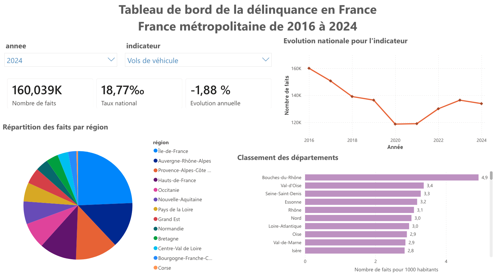

# Data Analyst & Data Scientist — BI, Machine Learning et IA
[Me contacter](mailto:vplusquellec.data@gmail.com)
·
[LinkedIn](https://www.linkedin.com/in/valerie-plusquellec-65b83b33b/)

Je conçois des solutions d’analyse de données et d’intelligence artificielle permettant d’éclairer la prise de décision, de la préparation des données jusqu’à la modélisation et à la restitution des résultats.

***

## CE QUE JE PEUX APPORTER

**Data Analysis** : Explorer, nettoyer et structurer des données complexes afin d’en extraire des résultats exploitables.

**Business Intelligence** : Définir des indicateurs métier et construire des tableaux de bord décisionnels avec SQL et Power BI.

**Machine Learning** : Développer, évaluer et comparer des modèles prédictifs robustes et interprétables.

**Intelligence artificielle & NLP** : Concevoir des prototypes reposant sur le deep learning, les modèles de langage, les embeddings et le traitement automatique du langage.

**Communication** : Restituer les résultats de manière claire auprès d’un public technique ou métier.

***

## UNE SELECTION DE PROJETS

#### 1. Tableau de bord décisionnel de la délinquance en France (Python • SQL • Power BI) [⁠Lien](projets/crime-dashboard)

Conception d’une chaîne décisionnelle complète à partir de données ouvertes : préparation et exploration des données sous Python, modélisation d’un entrepôt de données en schéma en étoile sous MySQL, création de vues SQL dédiées aux indicateurs métier et réalisation d’un tableau de bord interactif Power BI pour analyser les tendances nationales, les disparités territoriales et les principaux indicateurs de délinquance.

*Outils : Python (Pandas, Matplotlib), MySQL, SQL, Power BI*

***

#### 2. Décision d'accorder ou non un crédit bancaire (Python) [lien](https://github.com/valplus6/valerie.plusquellec/blob/6284faab3de8cf0aa3d2856b58f92262285bc122/projets/RCP209_Projet_Plusquellec.pdf)  

Développement d’un modèle prédictif de risque de crédit à partir de données bancaires : analyse exploratoire, comparaison de plusieurs modèles de classification (AFD, CART, AdaBoost, SVM RBF, MLP) et évaluation de leurs performances afin d’identifier la solution la plus adaptée à la décision d’octroi.

*Outils : Python (pandas, matplotlib, seaborn, scikitLearn)*

***

#### 3. Classification multi-classe sur données complexes à haute dimension (R) [lien](https://github.com/valplus6/valerie.plusquellec/blob/main/projets/STA211_Projet_rapport.pdf)

Réalisation d’une analyse statistique et prédictive sur des données de grande dimension combinant réduction de dimension, apprentissage non supervisé et classification supervisée afin d’étudier l’apport de différentes représentations des données sur les performances des modèles.

*Outils :  R (FactoMineR, ggplot2, dplyr, randomForest, caret)*

***

#### 4. Etude de la qualité du café (R) [Lien](https://github.com/valplus6/valerie.plusquellec/blob/main/projets/qualite_cafe.pdf)

Analyse statistique de données mixtes visant à identifier les profils de qualité du café à partir de caractéristiques sensorielles et physico-chimiques. Le projet combine analyse factorielle, classification et interprétation des groupes obtenus afin de proposer une typologie des cafés.

*Outils : R (FactoMineR, missMDA, ggplot2, dplyr)*

***

## MES COMPÉTENCES TECHNIQUES

#### Analyse de données et statistiques
* Python : pandas, NumPy, matplotlib, seaborn
* R : dplyr, ggplot2, FactoMineR, missMDA
* Analyse exploratoire, réduction de dimension, classification et clustering

#### Machine Learning et Deep Learning
* Scikit-learn, TensorFlow, Keras, PyTorch
* Classification, régression et méthodes d’ensemble
* Validation croisée, optimisation des modèles et interprétation des résultats

#### Intelligence artificielle générative et NLP
* Hugging Face et Transformers
* LLM, embeddings et recherche sémantique
* NER et traitement automatique du langage
* Notions et expérimentations autour des systèmes RAG et des agents IA

#### Business Intelligence et bases de données
* SQL
* Power BI
* MySQL et SQLite
* Construction de KPI et de tableaux de bord

#### Data Engineering
* Spark
* Préparation et transformation de données

#### Optimisation
* Julia
* GLPK

#### Environnement et outils
* Git et GitHub
* Docker
* VS Code
* Jupyter
* RStudio
* MySQL Workbench

#### Langues
* Français : langue maternelle
* Anglais : niveau avancé

***

## MES FORMATIONS EN DATA

**MASTER TRIED (Traitement de l’Information et Exploitation des Données)**  
2024-2026 | CNAM Paris, Co-habilitation PARIS-SACLAY

**AGENT COURSE & LLM COURSE**  
2025-2026 | Hugging Face
