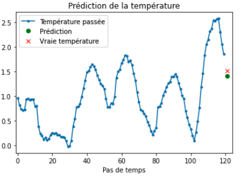
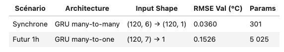
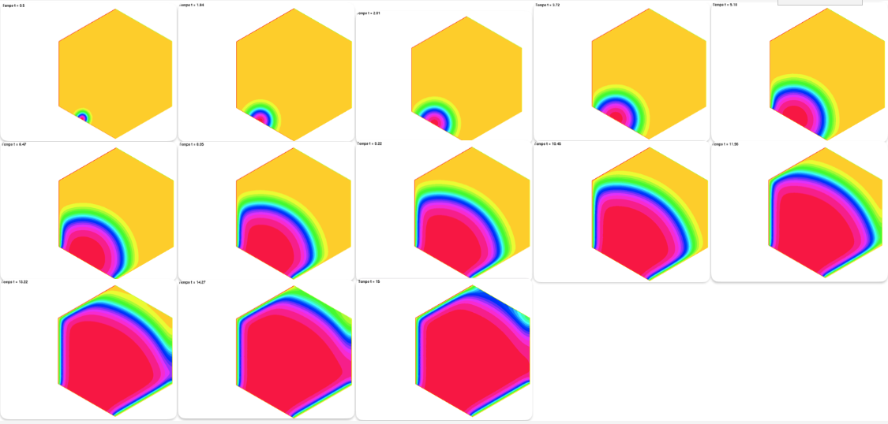

# VALÉRIE PLUSQUELLEC 
[LinkedIn](https://www.linkedin.com/in/valerie-plusquellec-65b83b33b/)
·
[Me contacter](mailto:vplusquellec.data@gmail.com)

### Data Analyst - Data Scientist
**Je conçois des solutions d’analyse de données permettant d’éclairer la prise de décision, de la préparation des données jusqu’à la restitution des résultats.**

Étudiante en 2e année de Master TRIED – CNAM Paris

***

## CE QUE JE PEUX APPORTER

**Data Analysis**

Explorer des données complexes et produire des analyses exploitables.

**Business Intelligence**

Construire des KPI et des tableaux de bord décisionnels avec SQL et Power BI.

**Machine Learning**

Développer des modèles prédictifs robustes et interprétables.

**Communication**

Restituer les résultats de manière claire auprès d’un public technique ou métier.

***

## MES RÉALISATIONS

#### 1. Décision d'accorder ou non un crédit bancaire (Python) [lien](https://github.com/valplus6/valerie.plusquellec/blob/6284faab3de8cf0aa3d2856b58f92262285bc122/projets/RCP209_Projet_Plusquellec.pdf)  
Construction d'un modèle prédictif pour mesurer si un crédit est risqué : EDA + Analyse et comparaison de modèles décisionnels (AFD, CART, ADABOOST, SVM RBF, MLP) 

*Outils : Python (pandas, matplotlib, seaborn, scikitLearn)*

#### 2. Classification multi-classe sur données complexes à haute dimension (R) [lien](https://github.com/valplus6/valerie.plusquellec/blob/main/projets/STA211_Projet_rapport.pdf)
Projet de machine learning supervisé et non supervisé sur un jeu de données composé de 649 variables structurées en plusieurs blocs d’indicateurs. Réalisation d’une analyse exploratoire globale et par blocs, réduction de dimension par ACP, classification des individus et des variables, puis comparaison de modèles supervisés pour prédire les classes. Analyse des variables discriminantes, des confusions entre classes et des performances des modèles afin de produire des résultats interprétables et reproductibles. 

*Outils : R, FactoMineR, ggplot2, dplyr, randomForest, caret*

#### 3. Prédiction de température (Python) [lien](https://github.com/valplus6/valerie.plusquellec/blob/d3a95c0747ae30e1b503b200a9ff97f665cbbf56/projets/Projet_serie_temp.ipynb)
Construction d'un réseau récurrent LSTM pour imputer des températures manquantes ou pour prédire une température future. 

*Outils : Python (pandas, matplotlib, TensorFlow, Keras)*

#### 4. Etude la qualité du café (R) [Lien](https://github.com/valplus6/valerie.plusquellec/blob/main/projets/qualite_cafe.pdf)
Approche statistique sous R pour caractériser la qualité du café à partir d’un jeu de données complexe : analyse factorielle de données mixtes, classifications et recommandations qualitatives. 

*Outils : R (ggplot2, dplyr)*

#### 5. Criminalité en France (Python) [Lien](https://github.com/valplus6/valerie.plusquellec/blob/main/projets/criminalite.ipynb)
Exploration des tendances de la criminalité sur les départements français : extraction, nettoyage, visualisation des données ouvertes, création de graphiques circulaires/barres empilées, analyse des variations selon le type de délit. 

*Outils : Python (pandas, matplotlib, numpy)*

#### 5. Propagation des frelons pattes jaunes (Python, FreeFEM++) [Lien](https://github.com/valplus6/valerie.plusquellec/blob/main/projets/propagation_frelons.ipynb)  
Modélisation et prédiction de la propagation et de la croissance des populations de frelons à pattes jaunes à l’aide d’équations aux dérivées partielles (Fisher-KPP), éléments finis et schémas d’Euler implicite. Génération de maillages hexagonaux et analyse d’impact des conditions aux bords. 

*Outils : Python(numpy, matplotlib), FreeFem++*

***

## MES COMPETENCES TECHNIQUES

**Data Analysis & Machine Learning**
* **Python** (NumPy, Pandas, Scikit-Learn, TensorFlow, PyTorch)
* **R** (FactoMineR, dplyr, ggplot2, cluster, mclust, randomForest, caret, missMDA)

**Business Intelligence & bases de données**
* Power BI
* SQL

**Data Engineering**
* Spark

**IA générative & NLP**
* Hugging Face
* LLM
* Embeddings
* NER

**Optimisation**
* GLPK
* Julia

**Outils**
* Git
* GitHub
* Docker
* VS Code
* Jupyter
* RStudio
* MySQL Workbench

**Langues**
* Français
* Anglais (niveau avancé)

***

## MES FORMATIONS EN DATA

**MASTER TRIED (Traitement de l’Information et Exploitation des Données)**  
2024-2026 | CNAM Paris, Co-habilitation PARIS-SACLAY

**AGENT COURSE et LLM COURSE**  
2025-2026 | Hugging Face
