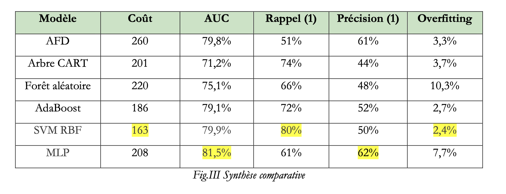
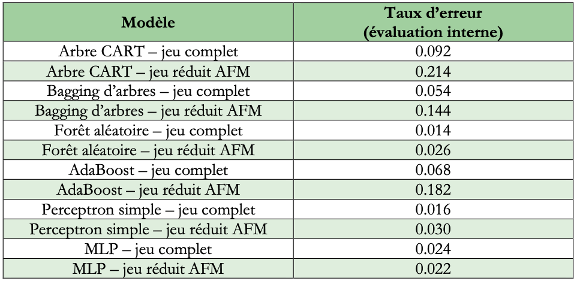
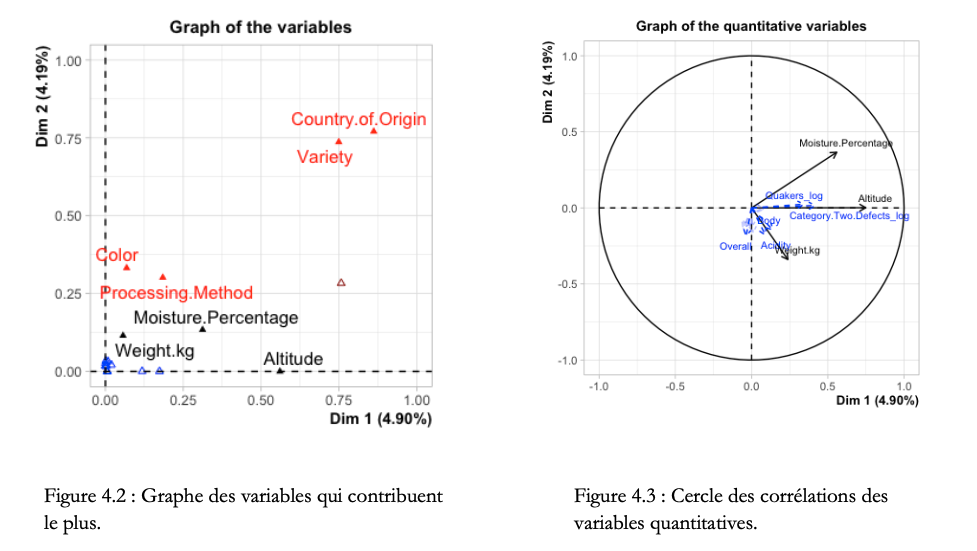
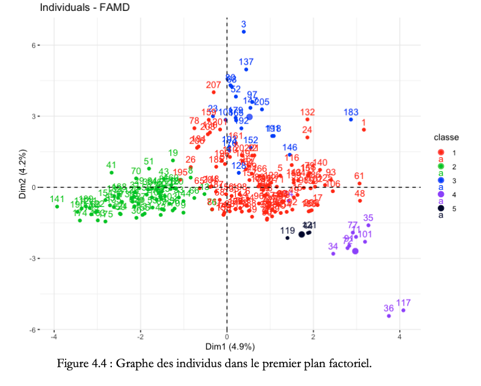
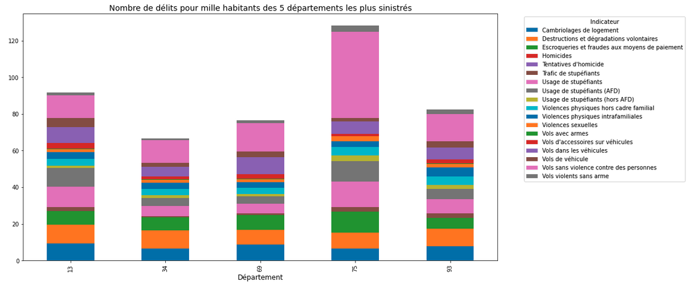
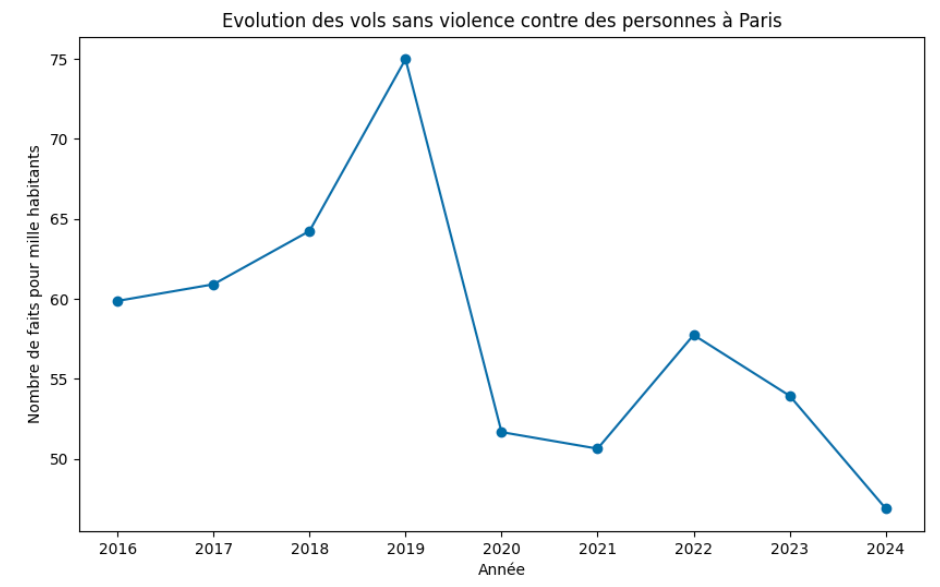

# Data Analyst | Data Scientist | IA & NLP
[Me contacter](mailto:vplusquellec.data@gmail.com)
·
[LinkedIn](https://www.linkedin.com/in/valerie-plusquellec-65b83b33b/)

Je conçois des solutions d’analyse de données permettant d’éclairer la prise de décision, de la préparation des données jusqu’à la restitution des résultats.

***

## CE QUE JE PEUX APPORTER

**Data Analysis**

Explorer, nettoyer et structurer des données complexes afin d’en extraire des résultats exploitables.

**Business Intelligence**

Définir des indicateurs métier et construire des tableaux de bord décisionnels avec SQL et Power BI.

**Machine Learning**

Développer, évaluer et comparer des modèles prédictifs robustes et interprétables.

**Intelligence artificielle & NLP**

Concevoir des prototypes reposant sur le deep learning, les modèles de langage, les embeddings et le traitement automatique du langage.

**Communication**

Restituer les résultats de manière claire auprès d’un public technique ou métier.

***

## MES RÉALISATIONS

#### 1. Décision d'accorder ou non un crédit bancaire (Python) [lien](https://github.com/valplus6/valerie.plusquellec/blob/6284faab3de8cf0aa3d2856b58f92262285bc122/projets/RCP209_Projet_Plusquellec.pdf)  
Construction d'un modèle prédictif pour mesurer si un crédit est risqué : EDA + Analyse et comparaison de modèles décisionnels (AFD, CART, ADABOOST, SVM RBF, MLP) 

*Outils : Python (pandas, matplotlib, seaborn, scikitLearn)*

#### 2. Classification multi-classe sur données complexes à haute dimension (R) [lien](https://github.com/valplus6/valerie.plusquellec/blob/main/projets/STA211_Projet_rapport.pdf)
Projet combinant analyse statistique multivariée, apprentissage non supervisé et classification supervisée sur des données à haute dimension.

*Outils : R, FactoMineR, ggplot2, dplyr, randomForest, caret*

#### 3. Etude de la qualité du café (R) [Lien](https://github.com/valplus6/valerie.plusquellec/blob/main/projets/qualite_cafe.pdf)
Approche statistique sous R pour caractériser la qualité du café à partir d’un jeu de données complexe : analyse factorielle de données mixtes, classifications et recommandations qualitatives. 

*Outils : R (ggplot2, dplyr)*

#### 4. Criminalité en France (Python) [Lien](https://github.com/valplus6/valerie.plusquellec/blob/main/projets/criminalite.ipynb)
Exploration des tendances de la criminalité sur les départements français : extraction, nettoyage, visualisation des données ouvertes, création de graphiques circulaires/barres empilées, analyse des variations selon le type de délit. 

*Outils : Python (pandas, matplotlib, numpy)*

***

## MES COMPÉTENCES TECHNIQUES

#### Analyse de données et statistiques
* Python : pandas, NumPy, matplotlib, seaborn
* R : dplyr, ggplot2, FactoMineR, missMDA
* Analyse exploratoire, réduction de dimension, classification et clustering

#### Machine Learning et Deep Learning
* Scikit-learn, TensorFlow, Keras, PyTorch
* Classification, régression et méthodes d’ensemble
* Validation croisée, optimisation des modèles et interprétation des résultats

#### Intelligence artificielle générative et NLP
* Hugging Face et Transformers
* LLM, embeddings et recherche sémantique
* NER et traitement automatique du langage
* Notions et expérimentations autour des systèmes RAG et des agents IA

#### Business Intelligence et bases de données
* SQL
* Power BI
* MySQL et SQLite
* Construction de KPI et de tableaux de bord

#### Data Engineering
* Spark
* Préparation et transformation de données

#### Optimisation
* Julia
* GLPK

#### Environnement et outils
* Git et GitHub
* Docker
* VS Code
* Jupyter
* RStudio
* MySQL Workbench

#### Langues
* Français : langue maternelle
* Anglais : niveau avancé

***

## MES FORMATIONS EN DATA

**MASTER TRIED (Traitement de l’Information et Exploitation des Données)**  
2024-2026 | CNAM Paris, Co-habilitation PARIS-SACLAY

**AGENT COURSE & LLM COURSE**  
2025-2026 | Hugging Face
