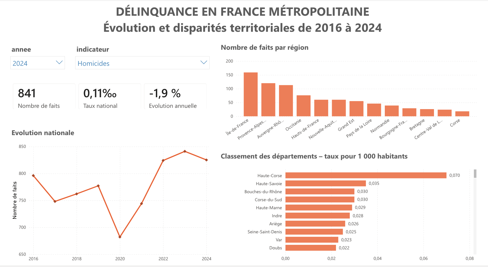
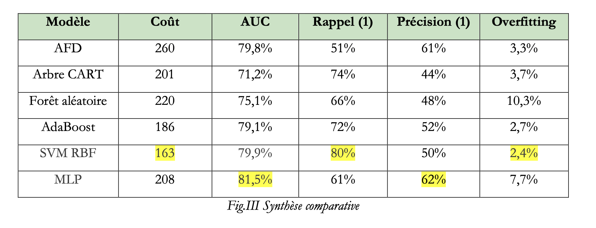
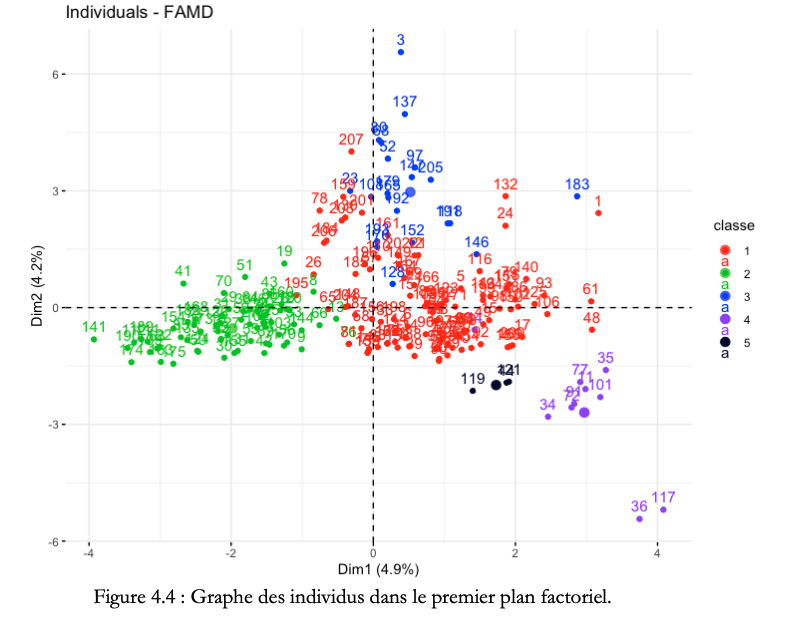
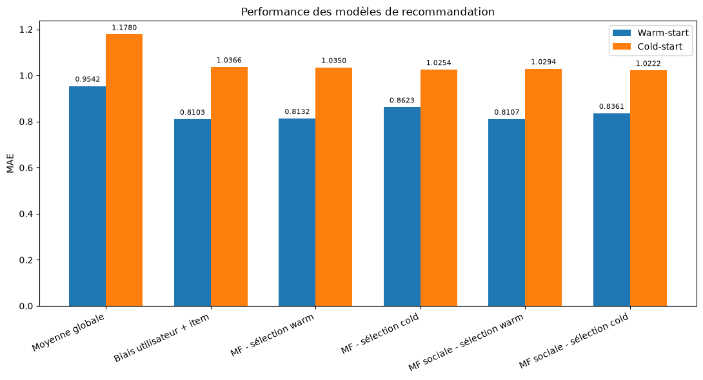
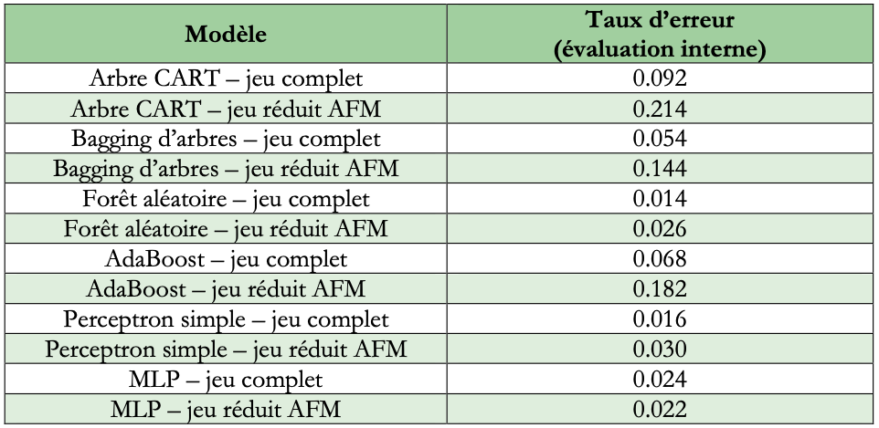

# Data Analyst

**Recherche de stage Data Analyst • 6 mois • Disponible à partir d’octobre 2026 • Île-de-France**

[Me contacter](mailto:vplusquellec.data@gmail.com)
·
[LinkedIn](https://www.linkedin.com/in/valerie-plusquellec-65b83b33b/)

J’aime comprendre ce que racontent les données et les transformer en informations utiles à la décision.

J’utilise principalement Python, SQL et Power BI pour explorer et structurer les données, construire des indicateurs et restituer les résultats. Ma formation me permet également d’aller jusqu’à la modélisation statistique et au Machine Learning.
***

## CE QUE JE PEUX APPORTER

**Data Analysis** : Explorer, nettoyer et structurer des données complexes afin d’en extraire des résultats exploitables.

**Business Intelligence** : Définir des indicateurs métier et construire des tableaux de bord décisionnels avec SQL et Power BI.

**Visualisation & restitution** : Transformer les résultats d’analyse en représentations claires et compréhensibles pour faciliter leur interprétation et leur utilisation.

**Machine Learning** : Développer, évaluer et comparer des modèles prédictifs et des systèmes de recommandation.

**Communication** : Synthétiser les résultats et rendre accessibles des sujets techniques à différents interlocuteurs.

***

## UNE SÉLECTION DE MES PROJETS

### Tableau de bord décisionnel de la délinquance en France (Python • SQL • Power BI) [Dépôt GitHub](https://github.com/valplus6/valerie.plusquellec/tree/main/projets/crime-dashboard)

Conception d’une chaîne décisionnelle complète à partir de données ouvertes : préparation et exploration des données sous Python, modélisation d’un entrepôt de données en schéma en étoile sous MySQL, création de vues SQL dédiées aux indicateurs métier et réalisation d’un tableau de bord interactif Power BI pour analyser les tendances nationales, les disparités territoriales et les principaux indicateurs de délinquance.

*Outils : Python (pandas, Matplotlib), MySQL, SQL, Power BI*

***

### Analyse et prédiction du risque de crédit bancaire (Python) [Dépôt GitHub](https://github.com/valplus6/valerie.plusquellec/tree/20606ffb07358eeb74ead343c6e44be4c9b42fd6/projets/credit-risk)

Analyse de données bancaires visant à étudier et prédire le risque de crédit : exploration et préparation des données, comparaison de plusieurs modèles de classification (AFD, CART, AdaBoost, SVM RBF, MLP) et évaluation de leurs performances pour identifier la solution la plus adaptée à la décision d’octroi.

*Outils : Python (pandas, Matplotlib, seaborn, scikit-learn)*

***

### Analyse multidimensionnelle de la qualité du café (R) [Dépôt GitHub](https://github.com/valplus6/valerie.plusquellec/tree/20606ffb07358eeb74ead343c6e44be4c9b42fd6/projets/coffee-quality)

Analyse statistique de données mixtes visant à identifier les profils de qualité du café à partir de caractéristiques sensorielles et physico-chimiques. Le projet combine analyse factorielle, classification et interprétation des groupes obtenus afin de proposer une typologie des cafés.

*Outils : R (FactoMineR, missMDA, ggplot2, dplyr)*

***

### Système de recommandation sociale et cold-start (Python) [Dépôt GitHub](https://github.com/valplus6/valerie.plusquellec/tree/main/projets/recommandation-sociale)

Développement et comparaison de systèmes de recommandation sur plus de 1,2 million d’évaluations. Conception d’un protocole warm-start / cold-start et intégration d’un réseau de confiance à une factorisation matricielle pour étudier son apport lorsque les utilisateurs ne disposent d’aucun historique d’évaluation.

*Outils : Python (pandas, NumPy, Matplotlib, scikit-learn)*

***

### Classification multi-classe sur données de grande dimension (R) [Dépôt GitHub](https://github.com/valplus6/valerie.plusquellec/tree/20606ffb07358eeb74ead343c6e44be4c9b42fd6/projets/multiclass-classification)

Réalisation d’une analyse statistique et prédictive sur des données de grande dimension combinant réduction de dimension, apprentissage non supervisé et classification supervisée pour étudier l’apport de différentes représentations des données sur les performances des modèles.

*Outils : R (FactoMineR, ggplot2, dplyr, randomForest, caret)*

***

## MES COMPÉTENCES TECHNIQUES

#### Analyse de données et statistiques

* Python : pandas, NumPy, Matplotlib
* R : tidyverse, FactoMineR
* Analyse exploratoire • Statistiques • Analyse multidimensionnelle • Visualisation de données

#### SQL, bases de données et Business Intelligence

* SQL • MySQL • Modélisation relationnelle • Schéma en étoile
* Power BI • DAX • KPI • Tableaux de bord
* Excel • Reporting

#### Machine Learning et Deep Learning

* scikit-learn • TensorFlow • PyTorch
* Classification • Régression • Clustering • Systèmes de recommandation • Réseaux de neurones
* Validation croisée • Comparaison et sélection de modèles

#### Environnement et outils

* Git • GitHub • Docker
* VS Code • Jupyter • RStudio

#### Langues

* Français : langue maternelle
* Anglais : niveau B2

***

## MES FORMATIONS DATA

**MASTER TRIED (Traitement de l’Information et Exploitation des Données)**  
2024-2026 | CNAM Paris, co-habilitation Paris-Saclay

**ML-PRO**  
2026-En cours | Machine Learnia

