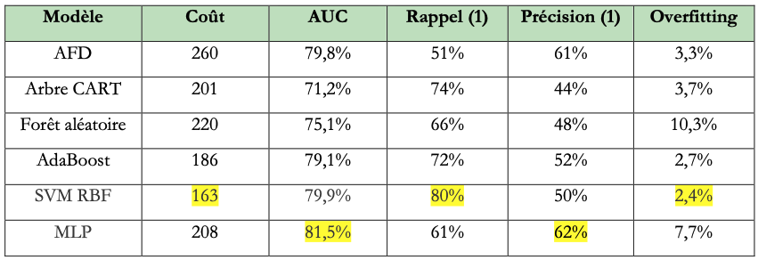

# Prédiction du risque de crédit bancaire
> **Projet de Machine Learning supervisé**
>
> **Objectif :** développer et comparer plusieurs modèles de classification afin de prédire le risque d'un crédit bancaire.
>
> **Technologies :** Python • Scikit-learn • Pandas • Matplotlib

---

## Objectif du projet

Les établissements bancaires doivent évaluer le risque associé à chaque demande de crédit afin de limiter les défauts de paiement.

L'objectif de ce projet est de construire un modèle capable de prédire si un demandeur présente un risque de crédit élevé à partir de ses caractéristiques personnelles, financières et professionnelles.

Au-delà de la simple recherche de précision, le projet s'intéresse au coût métier des erreurs de classification en tenant compte du fait qu'accorder un crédit à un mauvais payeur est beaucoup plus coûteux que refuser un bon dossier. rapport.pdf

---

## Jeu de données

Le projet repose sur le jeu de données **Statlog (German Credit Data)** du dépôt UCI Machine Learning Repository.

Il comprend :

- 1 000 demandes de crédit
- 20 variables explicatives
- 13 variables qualitatives
- 7 variables quantitatives
- une variable cible binaire indiquant si le crédit est risqué ou non. rapport.pdf

---

## Analyse exploratoire

Une analyse exploratoire a été réalisée afin de mieux comprendre les données avant la modélisation.

Les principales observations sont :

- jeu de données déséquilibré (majorité de bons payeurs) ;
- absence de corrélations linéaires fortes avec la variable cible ;
- influence de certaines variables comme la durée du prêt, son montant ou l'âge de l'emprunteur.

Ces résultats ont conduit au choix de modèles de classification supervisée capables de capturer des relations non linéaires.  [oai_citation:3‡rapport.pdf](sediment://file_000000003b9081f4bf1fd7ab6059c7d1)

---

## Méthodologie

Toutes les méthodes reposent sur le même pipeline de traitement :

- séparation apprentissage / test (70 % / 30 %) avec stratification ;
- standardisation des variables numériques ;
- encodage One-Hot des variables catégorielles ;
- optimisation des hyperparamètres par validation croisée stratifiée (GridSearchCV).

Les modèles comparés sont :

- Analyse Factorielle Discriminante (AFD)
- Arbre de décision CART
- Forêt aléatoire
- AdaBoost
- SVM à noyau gaussien (RBF)
- Perceptron multicouches (MLP). rapport.pdf

---

## Évaluation des modèles

Les modèles ont été comparés à l'aide de plusieurs indicateurs :

- Accuracy
- AUC
- Précision
- Rappel
- F1-score
- Matrice de confusion

Une matrice de coût métier a également été utilisée afin de pénaliser davantage les faux négatifs, c'est-à-dire les mauvais payeurs considérés à tort comme fiables. rapport.pdf

---

## Résultats

Les expérimentations montrent que les modèles non linéaires obtiennent les meilleures performances.

Le SVM RBF présente le meilleur compromis entre capacité de discrimination et coût métier, tandis qu'AdaBoost obtient également d'excellents résultats grâce à son mécanisme de boosting séquentiel. rapport.pdf



---

## Compétences mises en œuvre

### Data Analysis

- Analyse exploratoire
- Visualisation des données
- Analyse des corrélations

### Machine Learning

- Classification supervisée
- Validation croisée
- Optimisation d'hyperparamètres (GridSearchCV)
- Gestion du déséquilibre des classes
- Évaluation multicritère des modèles

### Python

- Pandas
- NumPy
- Matplotlib
- Scikit-learn

---

## Arborescence du projet

```text
Credit-Risk/
├── README.md
├── notebooks/
│   └── credit_risk.ipynb
├── images/
│   ├── comparaison_modeles.png
│   ├── pipeline.png
│   └── confusion_matrix.png
└── rapport/
    └── rapport.pdf
```

---

## Reproduire le projet

1. Installer les dépendances Python.
2. Ouvrir le notebook Jupyter.
3. Exécuter l'analyse exploratoire.
4. Lancer l'entraînement des différents modèles.
5. Comparer leurs performances.
