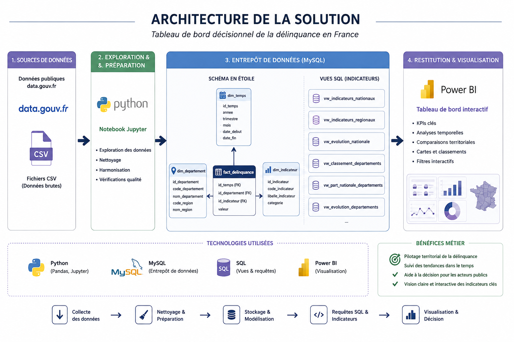
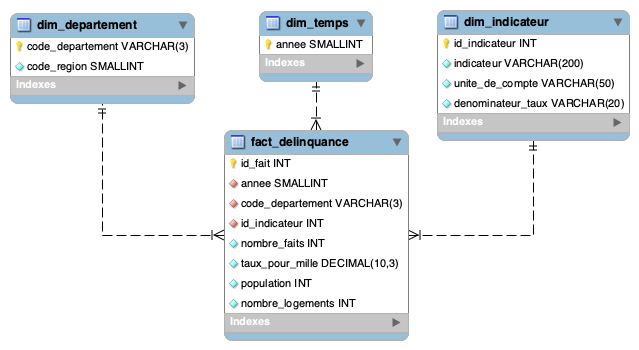

# Tableau de bord décisionnel de la délinquance en France

## Objectif du projet

Les administrations et collectivités disposent de nombreuses données publiques sur la délinquance. Cependant, ces données sont difficilement exploitables sans un outil permettant de suivre les principaux indicateurs, de comparer les territoires et d'identifier les évolutions au cours du temps.

L'objectif de ce projet est de concevoir une **chaîne décisionnelle complète**, depuis la préparation des données jusqu'à la réalisation d'un tableau de bord interactif destiné à faciliter l'analyse de la délinquance en France métropolitaine.

---

## Architecture de la solution



Le projet suit les principales étapes d'un processus décisionnel :

1. Collecte des données publiques (data.gouv.fr)
2. Préparation et nettoyage sous Python
3. Conception d'un entrepôt de données relationnel sous MySQL
4. Construction d'un schéma en étoile
5. Création de vues SQL dédiées aux indicateurs métier
6. Restitution des résultats dans un tableau de bord Power BI

---

## Données utilisées

Source :

**Base statistique de la délinquance enregistrée par la Police et la Gendarmerie nationales**

https://www.data.gouv.fr/

Le jeu de données couvre l'ensemble des départements métropolitains entre **2016 et 2024** et contient notamment :

- 18 catégories de crimes et délits
- les taux pour mille habitants (ou logements)
- les populations INSEE
- les codes géographiques des départements et régions

---

## Exploration et préparation des données

L'exploration des données a été réalisée sous Python avec **Pandas**.

Principales étapes :

- import des données
- contrôle de la qualité
- nettoyage
- vérification des valeurs manquantes
- analyses descriptives
- visualisations exploratoires

Le notebook complet est disponible dans :

```
codes/notebooks/01_exploration.ipynb
```

---

## Modélisation décisionnelle

Les données ont été organisées sous la forme d'un **schéma en étoile** afin de faciliter les analyses décisionnelles.



Le modèle comprend :

- une table de faits (*fact_delinquance*)
- trois dimensions :
  - Temps
  - Département
  - Indicateur

Cette modélisation permet de réaliser efficacement des analyses temporelles, territoriales et par catégorie d'infraction.

---

## Requêtes SQL

Le projet met en œuvre différentes techniques SQL :

- création d'un entrepôt de données
- alimentation des dimensions et de la table de faits
- vues analytiques
- fonctions analytiques (`LAG`, `RANK`)
- fonctions de fenêtrage (*Window Functions*)
- agrégations
- contrôles qualité des données

Les scripts sont disponibles dans :

```
codes/sql/
```

---

## Tableau de bord Power BI

Le tableau de bord permet notamment de :

- suivre les principaux indicateurs nationaux
- comparer les départements
- analyser les évolutions annuelles
- comparer les régions
- identifier les territoires les plus exposés
- filtrer dynamiquement les résultats


---

## Compétences mises en œuvre

### Data Engineering

- Nettoyage et préparation de données
- ETL
- Modélisation relationnelle
- Schéma en étoile

### SQL

- MySQL
- Jointures
- Agrégations
- Vues
- CTE
- Fonctions analytiques
- Window Functions

### Business Intelligence

- Construction de KPI
- Modélisation décisionnelle
- Dashboard Power BI

### Python

- Pandas
- NumPy
- Matplotlib
- Jupyter Notebook

---

## Arborescence du projet

```
Crime-Dashboard/

README.md

codes/
├── notebooks/
└── sql/

images/

powerbi/
```

---

## Technologies utilisées

- Python
- Pandas
- NumPy
- Jupyter Notebook
- MySQL
- SQL
- Power BI
- Git / GitHub
