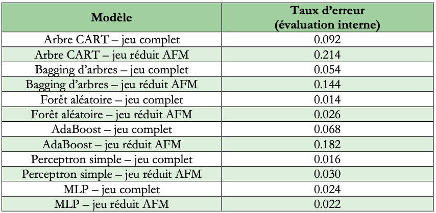

# Classification multi-classe sur données complexes à haute dimension

> **Projet de Data Science**
>
> **Problématique :** comment représenter efficacement des données de grande dimension afin d'améliorer les performances d'un modèle de classification multi-classe ?
>
> **Technologies :** R • Analyse statistique • Machine Learning

---

## Contexte

Les algorithmes de Machine Learning sont souvent confrontés à des jeux de données comportant plusieurs centaines de variables.

Toutes ces variables n'apportent pas la même information : certaines sont redondantes, d'autres peu discriminantes. Le choix d'une représentation pertinente des données devient alors une étape essentielle avant toute modélisation.

Ce projet étudie l'influence de différentes représentations d'un même jeu de données sur les performances d'un modèle de classification.

---

## Question étudiée

**Quelle représentation des données permet d'obtenir les meilleures performances pour une tâche de classification multi-classe ?**

Pour répondre à cette question, plusieurs représentations sont comparées :

- les variables originales ;
- les différents blocs de variables ;
- les composantes factorielles obtenues par Analyse Factorielle Multiple (AFM).

Ces différentes représentations sont ensuite utilisées pour entraîner et comparer plusieurs modèles de classification.

---

## Jeu de données

Le jeu de données comprend :

- 649 variables
- plusieurs représentations d'un même objet
- plusieurs classes à prédire

Cette structure permet d'étudier l'apport de différentes représentations dans un contexte de grande dimension.

---

## Démarche

Le projet suit une démarche expérimentale.

### 1. Comprendre les données

- exploration des différents blocs de variables ;
- analyse descriptive.

### 2. Construire plusieurs représentations

- Analyse Factorielle Multiple (AFM) ;
- extraction des composantes factorielles ;
- comparaison avec les variables originales.

### 3. Construire les modèles prédictifs

- apprentissage supervisé ;
- Random Forest ;
- validation croisée.

### 4. Comparer les performances

- évaluation des modèles selon la représentation utilisée ;
- identification des représentations les plus pertinentes.

---

## Principaux résultats

L'étude montre que le choix de la représentation influence directement la qualité de la classification.

Certaines représentations permettent de mieux séparer les classes et conduisent à des performances supérieures à celles obtenues avec les variables originales.

Le projet met ainsi en évidence l'intérêt d'une étape de réduction ou de transformation des données avant l'apprentissage supervisé.

---

## Résultats

Les performances des modèles ont été comparées selon plusieurs représentations des données :

- variables originales ;
- composantes issues de l'AFM ;
- représentations par blocs.

Cette comparaison met en évidence l'influence de la représentation des données sur les performances de classification.



---

## Compétences démontrées

### Analyse statistique

- Analyse exploratoire
- Analyse en Composantes Principales (ACP)
- Classification Ascendante Hiérarchique (CAH)

### Machine Learning

- Classification multi-classe
- Random Forest
- Validation croisée
- Comparaison de modèles

### Data Science

- Réduction de dimension
- Sélection de représentations
- Évaluation expérimentale

---

## Arborescence

```text
multiclass-classification/
├── README.md
├── codes/
├── data/
├── images/
└── rapport/
```

---

## Reproduire le projet

1. Charger les données.
2. Réaliser l'analyse exploratoire.
3. Construire les différentes représentations.
4. Entraîner les modèles.
5. Comparer les performances.

---

## Conclusion

Ce projet montre que la qualité d'un modèle de classification ne dépend pas uniquement de l'algorithme utilisé, mais également de la représentation des données en entrée.

Les expérimentations mettent en évidence que les composantes issues de l'Analyse Factorielle Multiple peuvent constituer une représentation plus pertinente que les variables originales pour certains modèles, tout en réduisant la dimension des données.
