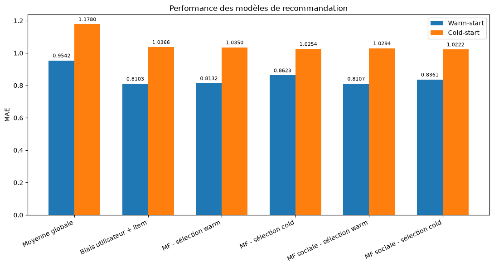

# Système de recommandation sociale et cold-start

## Objectif

Les systèmes de recommandation utilisent généralement l'historique des utilisateurs pour prédire leurs préférences. Cette approche devient cependant difficile lorsqu'un utilisateur dispose de peu ou pas d'évaluations.

Ce projet étudie si les **relations de confiance entre utilisateurs** peuvent apporter une information supplémentaire pour améliorer les recommandations, en particulier dans une situation de **cold-start**, lorsqu'un utilisateur ne possède aucun historique d'évaluation.

L'étude s'appuie sur les données de la plateforme **Epinions** et s'inspire du principe proposé dans l'article *SoRec: Social Recommendation Using Probabilistic Matrix Factorization*.

---

## Données

Le jeu de données combine des évaluations de produits et un réseau de confiance entre utilisateurs.

Après préparation et nettoyage :

- **1 238 946 évaluations**
- **128 962 utilisateurs**
- **346 658 items**
- **580 526 relations de confiance**
- notes comprises entre 1 et 5

La matrice utilisateurs-items est extrêmement creuse, avec une densité d'environ **0,00277 %**.

De plus, **71,4 % des utilisateurs ont évalué cinq items ou moins**. La faible quantité d'information disponible pour une grande partie des utilisateurs motive l'étude spécifique du cold-start.

---

## Approche

Deux situations sont distinguées :

- **Warm-start** : l'utilisateur possède déjà des évaluations dans les données d'apprentissage.
- **Cold-start** : l'utilisateur ne possède aucune évaluation dans les données d'apprentissage, mais dispose de relations exploitables dans le réseau de confiance.

Plusieurs modèles sont développés et comparés :

1. moyenne globale ;
2. modèle avec biais utilisateur et item ;
3. factorisation matricielle ;
4. factorisation matricielle sociale intégrant le réseau de confiance.

La **MAE (Mean Absolute Error)** est utilisée pour évaluer les prédictions.

Les hyperparamètres sont sélectionnés sur des ensembles de validation distincts des ensembles de test utilisés pour l'évaluation finale.

---

## Factorisation matricielle sociale

La factorisation matricielle représente les utilisateurs et les items par des vecteurs de facteurs latents appris à partir des évaluations.

Le modèle social ajoute les relations de confiance au processus d'apprentissage. La représentation latente d'un utilisateur est ainsi apprise conjointement à partir de ses évaluations et de ses relations sociales.

Cette approche présente un intérêt particulier en cold-start : même lorsqu'aucune évaluation n'est disponible pour un utilisateur, ses relations de confiance peuvent contribuer à apprendre sa représentation.

---

## Résultats

| Modèle | MAE warm-start | MAE cold-start |
|---|---:|---:|
| Moyenne globale | 0,9542 | 1,1780 |
| Biais utilisateur + item | **0,8103** | 1,0366 |
| MF – sélection warm-start | 0,8132 | 1,0350 |
| MF – sélection cold-start | 0,8623 | 1,0254 |
| MF sociale – sélection warm-start | 0,8107 | 1,0294 |
| MF sociale – sélection cold-start | 0,8361 | **1,0222** |

### Warm-start

Lorsque les utilisateurs disposent déjà d'un historique, le modèle avec biais obtient la meilleure MAE (**0,8103**).

Dans ce contexte, l'ajout de facteurs latents et de l'information sociale n'apporte pas d'amélioration notable.

### Cold-start

Lorsque les utilisateurs ne disposent d'aucun historique, la factorisation matricielle sélectionnée pour ce scénario améliore les prédictions par rapport au modèle avec biais :

**MAE : 1,0366 → 1,0254**

L'intégration du réseau de confiance améliore encore légèrement les performances :

**MAE : 1,0254 → 1,0222**

Le réseau de confiance permet donc d'apprendre une représentation latente des utilisateurs malgré l'absence d'historique d'évaluation. Le gain obtenu sur les prédictions reste cependant faible, de l'ordre de **0,3 %** par rapport à la factorisation non sociale.

---

## Limites et perspectives

Le faible écart entre les modèles social et non social doit être interprété avec prudence.

Le test cold-start porte sur **2 000 utilisateurs**, disposant tous de relations sociales exploitables, et les expériences reposent sur une seule partition des données.

Une extension du projet consisterait à répéter les expériences sur plusieurs partitions afin d'évaluer la stabilité du gain observé avec l'information sociale.

---

## Organisation du projet

Les notebooks présentent l'ensemble de la démarche expérimentale :

- `01_preparation_eda.ipynb` : préparation, nettoyage et analyse exploratoire des évaluations et du réseau de confiance ;
- `02_modelisation.ipynb` : construction du protocole warm-start / cold-start, modèles de référence, factorisation matricielle, extension sociale, sélection des hyperparamètres et évaluation finale.

Les notebooks ont volontairement été conservés dans leur forme expérimentale afin de documenter les différentes étapes ayant conduit aux modèles retenus.

---

## Compétences mises en œuvre

- préparation et analyse exploratoire de données ;
- traitement de données fortement creuses ;
- systèmes de recommandation ;
- factorisation matricielle ;
- apprentissage de représentations latentes ;
- exploitation d'un réseau de confiance ;
- conception d'un protocole warm-start / cold-start ;
- sélection d'hyperparamètres ;
- early stopping ;
- évaluation et comparaison de modèles.

---

## Technologies

**Python · pandas · NumPy · Matplotlib · scikit-learn**
